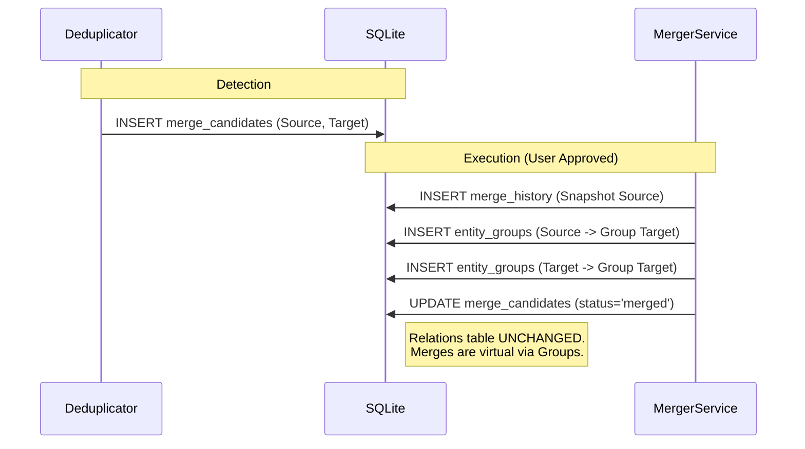

# Prism Architecture Map

> **Status**: Live Map
> **Last Updated**: 2026-01-08

This document provides a top-down view of the Prism Server architecture, tracing the flow of information from user entry points, through the intelligence engines and graph middleware, into the persistent memory store, and finally through the self-regulating feedback loops.

## 🗺️ Top-Down Visual Map

```mermaid
graph TD
    %% [Mermaid code preserved...]
    %% --- Styles ---
    classDef interface fill:#e1f5fe,stroke:#01579b,stroke-width:2px;
    classDef engine fill:#fff3e0,stroke:#e65100,stroke-width:2px;
    classDef graph fill:#f3e5f5,stroke:#4a148c,stroke-width:2px;
    classDef atom fill:#e1bee7,stroke:#4a148c,stroke-dasharray: 5 5;
    classDef data fill:#e8f5e9,stroke:#1b5e20,stroke-width:2px;
    classDef loop fill:#ffebee,stroke:#b71c1c,stroke-width:2px;
    
    %% --- Layer 1: Interface ---
    subgraph Interface ["Layer 1: Interface (Entry Points)"]
        CLI[Unified CLI<br/>(prism explore/ingest)]:::interface
        API[Fastify API<br/>(/api/search, /api/ask)]:::interface
    end

    %% --- Layer 2: Intelligence ---
    subgraph Brain ["Layer 2: Intelligence Engines"]
        Scout[Scout Agent<br/>(Outward Research)]:::engine
        DeepEx[Deep Explorer<br/>(Internal Recall)]:::engine
        Digest[Digest Engine<br/>(Content Extraction)]:::engine
    end

    %% --- Layer 3: Graph Link ---
    subgraph NervousSystem ["Layer 3: Graph Link (Middleware)"]
        GW[GraphWriter]:::graph
        GR[GraphReader]:::graph
        
        subgraph Atoms ["Processing Atoms"]
            AtomExtract[EntityExtractionAtom]:::atom
            AtomIrony[IronyAtom]:::atom
            AtomEmo[EmotionalAtom]:::atom
            AtomCausal[CausalAtom]:::atom
            AtomEv[EvidenceAtom]:::atom
        end
    end

    %% --- Layer 4: Data ---
    subgraph Memory ["Layer 4: Data Store (SQLite)"]
        TabMem[Memories<br/>(Raw Content)]:::data
        TabEnt[Entities<br/>(Nodes)]:::data
        TabRel[Relations<br/>(Edges)]:::data
        TabGrp[Entity Groups<br/>(Equivalence)]:::data
        TabPub[Public Content<br/>(World Knowledge)]:::data
        
        %% UI Projection
        TabPB[Page Blocks<br/>(UI Projection)]:::data
    end

    %% --- Layer 5: Feedback ---
    subgraph Loops ["Layer 5: Feedback Loops"]
        Gardener[Gardener<br/>(Deduplication)]:::loop
        Serendipity[Serendipity<br/>(Connection Discovery)]:::loop
    end

    %% --- Connections ---
    
    %% Entry -> Engines
    CLI -->|explore| Scout
    CLI -->|ingest| Digest
    API -->|ask| DeepEx
    API -->|ingest| Digest
    
    %% Engines -> Graph Link
    Scout -->|findings| GW
    Digest -->|content| GW
    DeepEx -->|query| GR
    
    %% Middleware Flow
    GW --> AtomExtract
    AtomExtract --> AtomIrony
    AtomIrony --> AtomCausal
    AtomCausal --> AtomEmo
    AtomEmo --> AtomEv
    AtomEv -->|write| TabEnt
    
    %% Atoms Logic
    AtomExtract -->|extract| TabEnt
    AtomExtract -->|link| TabRel
    AtomExtract -.->|read context| GR
    
    %% Reading
    GR -.->|read| TabEnt
    GR -.->|read| TabRel
    GR -.->|resolve| TabGrp
    
    %% Data Intricacies
    TabEnt --- TabGrp
    TabEnt --- TabPB
    TabMem -->|source of| TabEnt
    
    %% Feedback Loops
    Gardener -->|scan duplicates| TabEnt
    Gardener -->|merge| TabGrp
    Serendipity -->|analyze path| TabEnt
    Serendipity -->|inject| TabPub
    
```

## 🔠 ASCII Map (Alternative View)

```text
┌───────────────────────────────────────────────────────────────┐
│                 Layer 1: INTERFACE (Entry)                    │
│                                                               │
│    [ Unified CLI ]                  [ Fastify API ]           │
│   (explore/ingest)                 (search/ask/ingest)        │
└─────────┬─────────────────────────────────┬───────────────────┘
          │                                 │
          ▼                                 ▼
┌───────────────────────────────────────────────────────────────┐
│                 Layer 2: INTELLIGENCE (Brain)                 │
│                                                               │
│  [ Scout Agent ]    [ Digest Engine ]    [ Deep Explorer ]    │
│ (Outward Search)   (Content Extract)     (Internal Recall)    │
└─────────┬───────────────────┬───────────────────▲─────────────┘
          │ (findings)        │ (content)         │ (query)
          ▼                   ▼                   │
┌─────────────────────────────────────────────────│─────────────┐
│                 Layer 3: GRAPH LINK (Nervous System)          │
│                                                 │             │
│   [ GraphWriter ] ──────────────────> [ Atoms Middleware ]    │
│         │                                       │             │
│         │                             1. EntityExtractionAtom │
│   [ GraphReader ] <────────────────── 2. IronyAtom            │
│         │                             3. CausalAtom           │
│         │                             4. EmotionalAtom        │
│         │                             5. EvidenceAtom         │
└─────────│───────────────────────────────────────│─────────────┘
          │ (read)                                ▼ (write)
          ▼                                                     │
┌───────────────────────────────────────────────────────────────│
│                 Layer 4: DATA STORE (SQLite Memory)           │
│                                                               │
│   [ Memories ] <──(source)── [ Entities ] ─── [ Relations ]   │
│                                   │                           │
│   [ Public Content ]         [ Entity Groups ]                │
│                               (Equivalence)                   │
│                                   │                           │
│   [ Page Blocks ] <───────────────┘                           │
│   (UI Projection)                                             │
└───────────────────────────────────▲────────────────────────▲──┘
                                    │                        │
┌───────────────────────────────────│────────────────────────│──┐
│                 Layer 5: FEEDBACK LOOPS (Self-Regulation)  │  │
│                                   │                        │  │
│             [ Gardener ] ─────────┘      [ Serendipity ] ──┘  │
│           (Deduplication)               (Connection Discovery)│
└───────────────────────────────────────────────────────────────┘
```

### 🔄 Bidirectional Graph Interaction (2025-12 Enhancement)

The Intelligence Engines (Scout, DeepExplorer) now have **bidirectional interaction** with the Graph:

```text
┌─────────────────────────────────────────────────────────────────┐
│                 BIDIRECTIONAL FLOW                              │
│                                                                 │
│   [ Scout Agent ]              [ Deep Explorer ]                │
│         │                            │                          │
│         │◄── getFingerprint() ──────►│  (Graph → Engine)        │
│         │    (构建搜索指纹,包含关系)   │                          │
│         │                            │                          │
│         │─── ingestFinding() ───────►│  (Engine → Graph)        │
│         │    (写入发现)               │                          │
│         ▼                            ▼                          │
│              ┌──────────────────────┐                           │
│              │    PRISM GRAPH       │                           │
│              │ entities + relations │                           │
│              └──────────────────────┘                           │
│                                                                 │
│   反馈循环: 新发现 → 丰富图谱 → 更精准的搜索 → 更多发现           │
└─────────────────────────────────────────────────────────────────┘
```

| Direction | Flow | Method | Purpose |
|-----------|------|--------|---------|
| **Graph → Engine** | Read | `getFingerprint()` | Build context-aware search queries using existing relations |
| **Engine → Graph** | Write | `ingestFinding()` | Store discoveries back into the graph |

---

## 🏗️ Layer Breakdown

### Layer 1: Interface (Entry Points)
The surface area of Prism. All external interactions must pass through here.
- **Unified CLI (`src/cli/`)**: The operator's console. Handles manual ingestion (`prism ingest`), research missions (`prism explore`), and system maintenance.
- **Fastify API (`src/server.ts`)**: The application bridge. Serves the Magpie frontend and other clients. Handles real-time search, Q&A, and ingestion requests.

### Layer 2: Intelligence Engines (The Brain)
Processing units that generate or retrieve intelligence.
- **Scout (`src/lib/scout/`)**: The active researcher. Goes out to the web (or mock sources) to find fresh information based on "Vague Entities".
- **Deep Explorer (`src/lib/deep-explorer/`)**: The introspective thinker. Uses RAG and recursive queries to recall and synthesize information from existing memory.
- **Digest Engine (`src/digest.ts`)**: The stomach. Takes raw text or URLs, cleans them, and prepares them for the Graph Link layer.

### Layer 3: Graph Link (The Nervous System)
The routing and processing layer. It ensures no data enters the brain without being "felt" and analyzed.
- **GraphWriter (`src/lib/graph-link/writer.ts`)**: The write-head. It uses a middleware chain (Atoms) to process every piece of incoming information.
- **Atoms**:
    - **EntityExtraction**: Uses LLMs to identify entities (People, Projects) and their relations. *Key for structure.*
    - **Irony**: Detects contrast between expectation and reality.
    - **Emotional**: Maps the sentiment and emotional weight.
    - **Causal**: Identifies cause-and-effect chains.
    - **Evidence**: Verify claims against known facts.
- **GraphReader (`src/lib/graph-link/reader.ts`)**: The read-head. Provides a unified API to query the graph, abstracting away complex joins and equivalence groups.
    - **`getFingerprint()`** *(Enhanced 2025-12)*: Returns a structured fingerprint including entity info AND related terms from the graph. Used by Scout and DeepExplorer for context-aware search.
    - **`enrichContext()`**: String-based fingerprint (calls `getFingerprint()` internally).
    - **`resolveEntity()`**: Fuzzy name → canonical entity ID.

### Layer 4: Data Store (The Memory)
The persistent state, stored in SQLite.
- **Entities & Relations**: The core graph structure.
- **Entity Groups**: Handles identity equivalence (e.g., "Julian" == "Julian Zheng").
- **Page Blocks**: The projection layer for the UI. Determines how entities are rendered as pages.
- **Public Content**: A cache of high-quality world knowledge found by Scout.

### Layer 5: Feedback Loops (Self-Regulation)
Async processes that maintain system health. All operate via a **durable SQLite queue** (`src/lib/queue/bun-queue.ts`).

- **Ripple (`src/lib/agents/ripple/`)**: The propagation engine. Triggered by entity creation/scout confirmation, generates profiles and onboards high-value content.
- **Curator (`src/lib/agents/curator/`)**: The immune system (formerly "Gardener"). Scans for duplicates using embeddings and merges them into Entity Groups.
- **Serendipity (`src/lib/serendipity/`)**: The subconscious. Watches user navigation paths to find unexpected connections and "Complete the Loop".

#### Agent Logging
All feedback loops persist structured logs to the `agent_logs` table:

| Agent | action | Description |
|-------|--------|-------------|
| `scout` | `ripple` | Event-driven knowledge propagation |
| `scout` | `patrol` | Scheduled external discovery |
| `deep_explorer` | `explore` | User-triggered deep research |
| `curator` | `cycle` | Deduplication analysis |

```sql
-- Recent operations
SELECT agent, action, status, duration_ms, created_at 
FROM agent_logs ORDER BY created_at DESC LIMIT 20;
```

---

## 🤝 Entity Merge Workflow & Database Integration

How the **Gardener** cooperates with the `entity_groups` schema to handle Identity Equivalence.

### 1. The Schema (`entity_groups`)
Instead of deleting entities or rewriting thousands of relations, Prism uses an **Equivalence Table** which acts as a redirection layer:

```sql
CREATE TABLE entity_groups (
    entity_id TEXT PRIMARY KEY,   -- e.g. "person:julian"
    group_id TEXT NOT NULL,       -- e.g. "person:julian_zheng" (Canonical ID)
    joined_by TEXT                -- e.g. "auto_merge"
);
```

### 2. The Merge Process
When `MergerService.merge("Target", "Source")` is called:

1.  **Snapshot**: Source entity is saved to `merge_history` JSON for undo capability.
2.  **Group Update**: 
    -   `Source` is inserted into `entity_groups` with `group_id = Target`.
    -   `Target` is ensured in `entity_groups` with `group_id = Target` (Self-canonical).
3.  **Zero-Write Relations**: The `relations` table is **NOT touched**. 
    -   `Source` keeps its incoming/outgoing edges (ID: "Source").
    -   `Target` keeps its edges (ID: "Target").
4.  **Read-Time Resolution**:
    -   `GraphReader` asks: "Get relations for Target".
    -   Database query: "Find all relations where endpoint IN (SELECT entity_id FROM entity_groups WHERE group_id = Target)".
    -   Result: Aggregated relations from both Source and Target, presented as if they belong to Target.

### 3. Visual Workflow



---

## 🧭 Relation Categories: UI vs. Semantic

Prism uses two distinct systems to connect nodes, serving different purposes.

### 1. Page Blocks (The "Presentation Layer")
*   **Purpose**: Determines **Layout & Navigation**. "What do I see when I open this page?"
*   **Storage**: `page_blocks` table.
*   **Bidirectionality**: **Strictly Enforced**.
    *   If a Memory creates an Entity, the Memory Page gets a block for that Entity.
    *   The Entity Page *automatically* gets a block pointing back to the Source Memory.
*   **User Experience**: This ensures you can always navigate "Up" to the source context and "Down" to extracted concepts.

### 2. Graph Relations (The "Semantic Layer")
*   **Purpose**: Determines **Meaning & Logic**. "How are these concepts intellectually related?"
*   **Storage**: `relations` table (`source`, `target`, `type`).
*   **Directionality**: **Semantic**.
    *   AI extracts: `Project A` -> `relatedTo` -> `Concept B`.
    *   Ideally bidirectional for "relatedTo", but often directional for specific types (e.g., `authored_by`, `mentions`).
*   **Usage**: Used by **Scout** and **deep search** to traverse the knowledge graph.

> **Role Summary**:
> *   **Page Blocks** = **Hyperlinks** (Navigation structure)
> *   **Relations** = **Synapses** (Brain structure)

---

## ⚖️ Ingest vs. Gardener: The Maintenance Divergence

While both systems maintain the graph, they behave differently regarding the `relations` vs `page_blocks` dual-write.

### 1. Ingest Phase (The "Writer")
*   **Behavior**: **Synchronous Dual-Write**.
*   **Code**: `EntityExtractionAtom` + `BlockFactory` (Standardized).
*   **Action**: When identifying an entity:
    1.  Writes to `relations` (Semantic Graph).
    2.  Writes to `page_blocks` (UI Layout) via `BlockFactory`.
        *   Enforces "Hero" structure: Header (Self) + Source (Backlink).
*   **Why**: Creates a complete, navigable page structure immediately upon ingestion.

### 2. Gardener Phase (The "Cleaner")
*   **Behavior**: **Asymmetric Maintenance**.
*   **Code**: `MergerService` (src/lib/gardener/merger.ts)
*   **Action**: When merging `A` -> `B`:
    1.  **Page Blocks**: **Physically Rewritten**.
        *   Updates `page_blocks` where `block_id=A` to `block_id=B`.
        *   This ensures the UI never renders a dead link.
    2.  **Relations**: **Virtually Merged**.
        *   Does **NOT** update `relations` table.
        *   Relies on `entity_groups` to redirect A's relations to B at query time.
*   **Why**: Rewriting millions of relations is expensive and risky. Redirecting them via Groups is instant and safer (undoable).

> **Conclusion**: Ingest is **Eager** (writes everything), Gardener is **Lazy** (virtualizes relations, but eagerly fixes UI).
